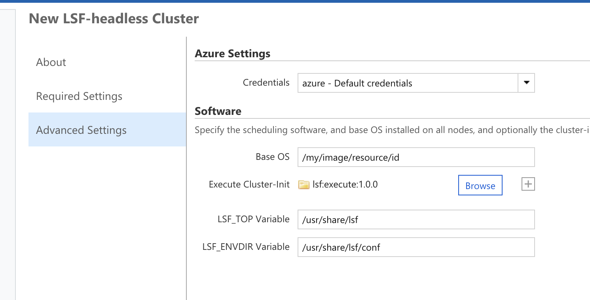

# LSF 

CycleCloud project for Spectrum LSF.

## Prerequisites

This project requires running Azure CycleCloud version 7.7.4 or later.

Users must provide as a minimum the following LSF binaries:

* lsf10.1_linux2.6-glibc2.3-x86_64.tar.Z
* lsf10.1_lsfinstall_linux_x86_64.tar.Z

which belong in the lsf project `blobs/` directory.

To use a licensed version (i.s.o. trial version), the following file is required:

* lsf_std_entitlement.dat

Also please provide Fix Pack 8 to the blobs directory, so the latest fixes can be applied:

* lsf10.1_linux2.6-glibc2.3-x86_64-520099.tar.Z


## Launching a trial version or an entitled version.

The installation files should be explicitly listed in the [project file](project.ini).
Note that there is an alternate [entitled project file](project.ini-entitled) in this 
repo.  

To launch a trial version of LSF, copy the two trial installers to the `blobs/` directory.

To launch a entitled version of LSF, copy the *three* installers and *one* entitlement
file to the `blobs/` directory and replace _project.ini_ with _project.ini-entitled_ which 
has the extended list of installer files.

One necessary configuration change is to set `lsf.entitled_install = true` in _lsf.txt_
indicating that the install process should download the FP7 and entitlement file.

## Start a LSF Cluster

This repo contains the [cyclecloud project](https://docs.microsoft.com/en-us/azure/cyclecloud/projects).  To get started with LSF:

1. Copy LSF installers into the `blobs/` directory.
1. Upload the lsf project to a locker `cyclecloud project upload`
1. Import the cluster as a service offering `cyclecloud import_cluster LSF -f lsf.txt -t`
1. Add the cluster to your managed cluster list in the CycleCloud UI with the _+add cluster_ button.

_NOTE_ : to avoid race conditions in HA master setup, transient software 
installation failures with recovery are expected.

## Resource Connector for Azure CycleCloud

This project extends the RC for LSF for an Azure CycleCloud provider: cyclecloud.

### Upgrading CycleCloud

A customer RC-compatible API is needed to run the resource connector which is available
in CycleCloud version >= 7.7.4. 
A recent CycleCloud can be downloaded from this [link](https://download.microsoft.com/download/D/4/7/D470EBC3-6756-4621-B1CD-AB16E96D2E8C/cyclecloud-7.7.5.x86_64.rpm)

The Resource Connector will be configured automatically when running the cluster from the _lsf.txt_ template.  

To configure an pre-existing LSF cluster to use CycleCloud RC proceed to the next steps.

### Installing the cyclecloud RC

The cyclecloud resource connector is not yet part of the LSF product release.
For now, it's necessary to install the provider plugin.

1. Copy the project files into the RC library on lsf.

```bash
wget https://github.com/Azure/cyclecloud-lsf/archive/feature/2.0.1-rc.zip
unzip master.zip
rc_source_dir="cyclecloud-lsf-master/specs/default/cluster-init/files/host_provider"

rc_scripts_dir=$LSF_SERVERDIR/../../resource_connector/cyclecloud/scripts
mkdir -p $rc_scripts_dir
cp $rc_source_dir/*.sh $rc_scripts_dir/
chmod +x $rc_scripts_dir/*.sh

mkdir -p $rc_scripts_dir/src/
cp $rc_source_dir/src/*.py $rc_scripts_dir/src/

```

2. Add the cyclecloud provider to the hostProvider file in the LSF conf directory: _$LSF_TOP/conf/resource_connector/hostProviders.json_

```json
{
  "providers": [
    {
      "type": "azureProv", 
      "name": "cyclecloud", 
      "scriptPath": "resource_connector/cyclecloud", 
      "confPath": "resource_connector/cyclecloud",
      "path": "resource_connector/cyclecloud/provider.json"
    }
  ]
}
```

### Configure cyclecloud provider

LSF will be communicating to CC via the cyclecloud resource connector.
The cyclecloud provider includes a CycleCloud host and cluster.
With a CycleCloud cluster configured add a provider entry to the cyclecloud provider file: _${LSF_TOP}/conf/resource_connector/cyclecloud/conf/cyclecloudprov_config.json_

An example of the provider file with a single cluster is below. The user name and password correspond to a CycleCloud user.
This user should be assigned the _cyclecloud_access_ role. 

```json
{
    "log_level": "info",
    "cyclecloud": {
        "cluster": {
            "name": "lsf-cluster-example"
        },
        "config": {
            "username": "cycle-api-user",
            "password": "cycl34P1P4ss0rd",
            "web_server": "https://cyclecloud.contoso.com"
        }
    }
}
```

Also the _${LSF_TOP}/conf/resource_connector/cyclecloud/conf/provider.json_ should be provided where the LSF actions translate to the AzureCC actions:

```json
{
    "host_type": "azure_host",
    "interfaces":
    [{
        "name": "getAvailableTemplates",
        "action": "resource_connector/cyclecloud/scripts/getAvailableTemplates.sh"
    },
    {
        "name": "getReturnRequests",
        "action": "resource_connector/cyclecloud/scripts/getReturnRequests.sh"
    },
    {
        "name": "requestMachines",
        "action": "resource_connector/cyclecloud/scripts/requestMachines.sh"
    },
    {
        "name": "requestReturnMachines",
        "action": "resource_connector/cyclecloud/scripts/requestReturnMachines.sh"
    },
    {
        "name": "getRequestStatus",
        "action": "resource_connector/cyclecloud/scripts/getRequestStatus.sh"
    }]
}
```

The provider interactions will be logged to _$LSF_LOGDIR/cyclecloud_prov.log_.


### Edit cluster configuration for cyclecloud

There are recommended configurations for declaring resources.  Add the following lines to _${LSF_TOP}/conf/lsf.conf_:

```txt
LSB_RC_EXTERNAL_HOST_FLAG="cyclecloudhost"
LSF_LOCAL_RESOURCES="[resource cyclecloudhost]"
```

And also add the following resources to the Resource section of _${LSF_TOP}/conf/lsf.shared_:

```txt
   cyclecloudhost  Boolean  ()       ()       (instances from Azure CycleCloud)
   cyclecloudmpi  Boolean   ()       ()       (instances that support MPI placement)
   cyclecloudlowprio  Boolean ()     ()       (instances that low priority / interruptible from Azure CycleCloud)
   ngpus      Numeric    ()       Y       (number of GPUs)
   nodearray  String     ()       ()       (nodearray from AzureCC)
   machinetype String    ()       ()       (Azure machine type name for AzureCC)
   zone       String     ()       ()       (zone/region for AzureCC)
   placementgroup String ()       ()       (id used to note locality of machines)
```


### Configure the cyclecloud provider templates (Optional)

_$LSF_TOP/conf/resource_connector/cyclecloud/conf/cyclecloudprov_templates.json_ 

This file isn't required, cyclecloud will populate the default contents of
the provider template file based on the nodearrays in the CycleCloud cluster.

Any host factory attributes can be provided in this file as an override.

```json
{
  "templates" : [
    {
      "templateId" : "ondemand",
      "attributes" : { 
        "ncores": ["Numeric", "2"],
        "ncpus": ["Numeric", "2"]
      }
    },
    {
      "templateId" : "gpu",
      "attributes" : {
        "ncores": ["Numeric", "8"],
        "ncpus": ["Numeric", "4"],
        "nodearray" : ["String" , "gpu"],
        "ngpus" : ["Numeric", "1"]
      },
    "customScriptUri": "https://clustermanage.blob.core.windows.net/utilities/scripts/user_data.sh"
    }
   ]
}
```

The `"templateId"` field corresponds to the nodearray name in the CycleCloud cluster. 
The `"nodearray"` attribute corresponds to the Resource in _lsf.shared_ and is used by the scheduler for job dispatching.

It's also advisable to increase `RC_MAX_REQUESTS` in lsb.params from the default value
of 300 to 5000 (or higher).

### Configure user_data.sh (Optional)

Configuring *LSF_LOCAL_RESOURCES* on hosts is important for job placement in azure.
User provided script, in the form of user_data.sh is the supported LSF mechanism for this.
CycleCloud has a default script that runs to advertise all (*) attributes in 
the in the template. It's recommended not to use a custom script unless necessary.


## Submit jobs

Once the cluster is running you can log into one of the master nodes and submit
jobs to the scheduler:

1. `cyclecloud connect master-1 -c my-lsf-cluster`
1. `bsub sleep 300`
1. You'll see an ondemand node start up and prepare to run jobs.
1. When the job queue is cleared, nodes will autoscale back down.

There are a number of default queue types in the CycleCloud LSF cluster.

```$ bqueues
QUEUE_NAME      PRIO STATUS          MAX JL/U JL/P JL/H NJOBS  PEND   RUN  SUSP 
cloud            30  Open:Active       -    -    -    -     0     0     0     0
cloudmpi         30  Open:Active       -    -    -    -     0     0     0     0
cloudlowprio     30  Open:Active       -    -    -    -     0     0     0     0
manual           30  Open:Active       -    -    -    -     0     0     0     0
```

* cloud - a general queue (default), for pleasantly parallel jobs.
* cloudmpi - a queue for tightly-coupled jobs.
* cloudlowprio - a queue for pre-emptible jobs which will run on low priority machines.
* manual - a queue which for jobs to run on manually created (non-autoscaling hosts).

## Start a "Headless" LSF Cluster

This project supports configuring and installing an LSF master host without
using the automation built in.  The following instructions describe how to set 
up this use-case.

### "Headless" cluster requisites

For this use-case certain assumptions are made about configurations.  The 

1. Using a custom VM image with either the LSF_CONF dir shared by NFS or a local copy of LSF_CONF
1. LSF is pre-installed on the master and/or a shared file system.

### Upload this project to your locker

Unlike the normal cluster, the "headless" cluster assumes that LSF is already installed
so that the cluster automation doesn't need the LSF installers and binaries.
**Remove the `[blobs]` section from the project.ini file** so that the lsf installers
are not expected.  Then, upload the project.

```bash
cyclecloud project upload my-locker
```

### Import the "Headless" cluster template

In the _templates_ directory exists the _lsf-headless.txt_ file.  This is appropriate
for the "headless" use-case.  Import the file as a cluster template into CycleCloud

```bash
cyclecloud import_cluster LSF-headless -f lsf-headless.txt -c lsf -t
```

### Configure the cluster in the UI

Using the create cluster menu, find the _LSF-headless_ template and proceed through
the configuration menus. General CycleCloud documentation can guide you through
selecting subnet and machine types.  Critical configurations for the "headless" lsf
project are in the Advanced/Software sub menu. 

* Base OS is the VM image that's been pre-created in the subscription referenced by Resource ID
* Select the _lsf:execute:1.0.0_ cluster-init in the picker, which you've just uploaded.
* For the custom image, provide the location of _LSF_TOP_, the root of the LSF install.
* For the custom image, provide the location of lsf.conf by setting _LSF\_ENVDIR_



### LSF_LOCAL_RESOURCES in lsf.conf

The worker nodes depend on access to the _LSF\_CONF_ directory. On the worker, an additional copy of the _lsf.conf_ file with be created at _LSF\_ENVDIR_.  This file will be automatically modified with *LSF_LOCAL_RESOURCES* which control job matching.

### Start the cluster and point cyclecloud_prov to the cluster and nodearray.

Now that the cluster is configure, it can be started. Start the cluster, and change
the cyclecloud_prov details to reference the new clustername and the _execute_ node array. 
The node array name should match the _templateId_ in cyclecloudprov_templates.json.


# Contributing

This project welcomes contributions and suggestions.  Most contributions require you to agree to a
Contributor License Agreement (CLA) declaring that you have the right to, and actually do, grant us
the rights to use your contribution. For details, visit https://cla.microsoft.com.

When you submit a pull request, a CLA-bot will automatically determine whether you need to provide
a CLA and decorate the PR appropriately (e.g., label, comment). Simply follow the instructions
provided by the bot. You will only need to do this once across all repos using our CLA.

This project has adopted the [Microsoft Open Source Code of Conduct](https://opensource.microsoft.com/codeofconduct/).
For more information see the [Code of Conduct FAQ](https://opensource.microsoft.com/codeofconduct/faq/) or
contact [opencode@microsoft.com](mailto:opencode@microsoft.com) with any additional questions or comments.
